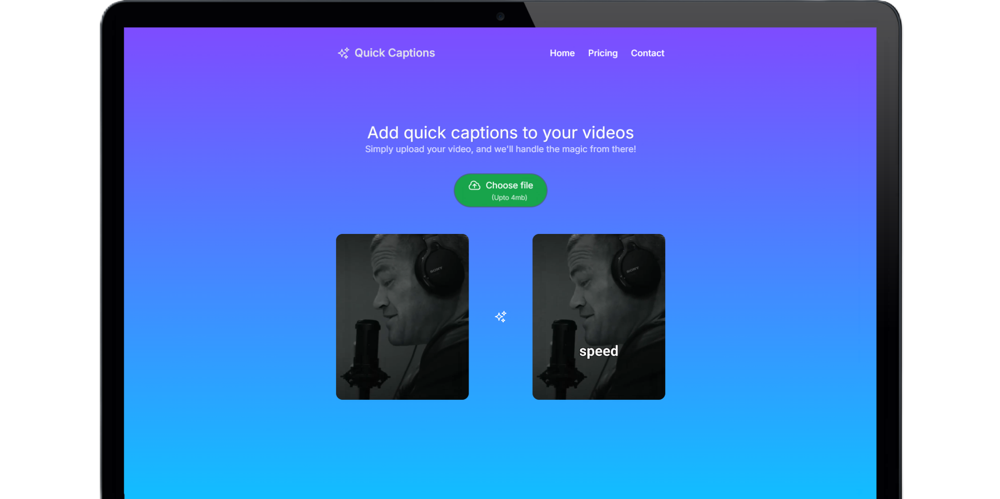

# 🎬 Quick Captions: AI-Powered Video Captioning Tool



## 📝 About

Quick Captions is an innovative AI-powered tool that revolutionizes the way you add captions to your videos. With advanced transcription processing using AWS services and seamless integration with video content through FFmpeg, this tool makes captioning effortless and efficient.

## 📋 Table of Contents

- [🎬 Quick Captions: AI-Powered Video Captioning Tool](#-caption-generator-ai-powered-video-captioning-tool)
  - [📝 About](#-about)
  - [📋 Table of Contents](#-table-of-contents)
  - [✨ Key Features](#-key-features)
  - [🛠️ Tech Stack](#️-tech-stack)
  - [📚 Documentation](#-documentation)
    - [Components](#components)
    - [API Endpoints](#api-endpoints)
    - [Utility Functions](#utility-functions)
  - [🚀 Installation](#-installation)
  - [🔧 Usage](#-usage)
  - [🤝 Contributing](#-contributing)
  - [📄 License](#-license)
  - [📞 Contact](#-contact)

## ✨ Key Features

- 🤖 AI-powered transcription using AWS Transcribe for accurate caption generation
- 🎨 Dynamic text overlays with customizable color options
- ☁️ AWS S3 integration for file storage and management
- 🔄 Real-time synchronization of captions with video content
- 🎥 FFmpeg utilization for smooth caption addition to videos
- 🖌️ Customizable caption styling based on user preferences
- 👀 Intuitive UI for efficient transcription editing
- 🔍 Real-time preview of caption changes

## 🛠️ Tech Stack

- **Frontend**: Next.js, React, Tailwind CSS, React Icons
- **AWS SDK**: @aws-sdk/client-s3, @aws-sdk/client-transcribe
- **Video Processing**: @ffmpeg/ffmpeg, @ffmpeg/util, fluent-ffmpeg
- **Additional Libraries**: aws-crt, axios, uniqid, uniqueid
- **Development Tools**: ESLint, PostCSS

## 📚 Documentation

### Components

- **TranscriptionEditor**: Manages and edits transcription items
- **ResultVideo**: Handles video display and applies captions using FFmpeg
- **FilePage**: Main page for managing file uploads and displaying transcription and video results
- **ContactPage**: Contact form and social links
- **PricingPage**: Pricing information for the service

### API Endpoints

- **POST /api/upload**: Uploads a file to AWS S3
- **GET /api/transcribe**: Fetches the transcription status and results from AWS Transcribe

### Utility Functions

- **clearTranscriptionItems**: Cleans up transcription items and formats them
- **transcriptionItemsToSrt**: Converts transcription items to SRT format

## 🚀 Installation

1. Clone the repository
   ```
   git clone https://github.com/vipulkatwal/quick-captions.git
   ```

2. Navigate to the project directory
   ```
   cd quick-captions
   ```

3. Install dependencies
   ```
   npm install
   ```

4. Set up environment variables
   Create a `.env.local` file in the root directory and add your AWS credentials:
   ```
   AWS_ACCESS_KEY_ID=your_access_key_id
   AWS_SECRET_ACCESS_KEY_ID=your_secret_access_key
   BUCKET_NAME_ID=your_s3_bucket_name
   ```

## 🔧 Usage

1. Ensure you have the necessary AWS credentials configured in your environment variables.

2. Start the development server
   ```
   npm run dev
   ```

3. Open your browser and visit `http://localhost:3000`

4. Upload a video file to begin the captioning process:
   - The file will be uploaded to AWS S3
   - AWS Transcribe will generate a transcription
   - Use the TranscriptionEditor to make any necessary adjustments
   - Preview the captions on the video using the ResultVideo component
   - Download the final captioned video

## 🤝 Contributing

We welcome contributions to Caption Generator! Please feel free to submit a Pull Request.

1. Fork the project
2. Create your feature branch (`git checkout -b feature/AmazingFeature`)
3. Commit your changes (`git commit -m 'Add some AmazingFeature'`)
4. Push to the branch (`git push origin feature/AmazingFeature`)
5. Open a Pull Request

## 📄 License

This project is licensed under the MIT License - see the [LICENSE](LICENSE) file for details.

## 📞 Contact

📧 Hit me up via email!:  [www.vipulkatwal17@gmail.com](www.vipulkatwal17@gmail.com)

Project Live Link: [Click Here](https://quick-captions.vercel.app/)

---

Happy captioning! 🎥✨
